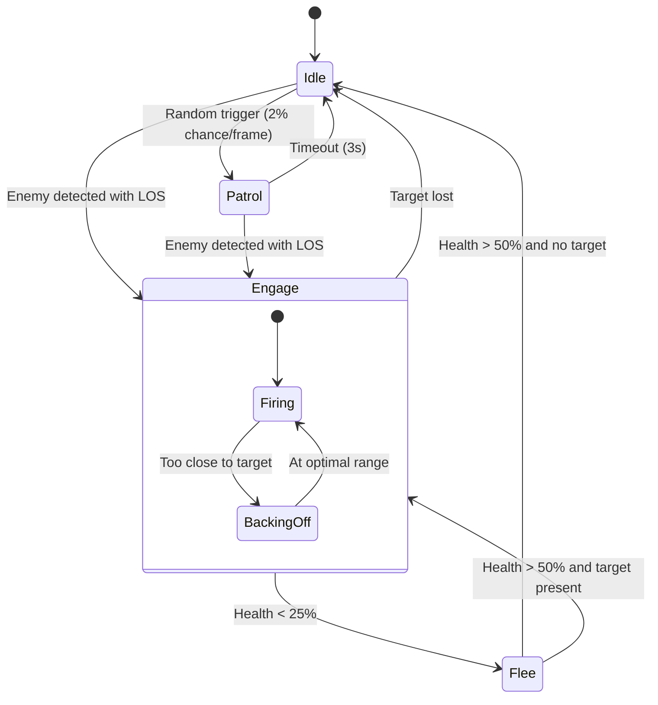
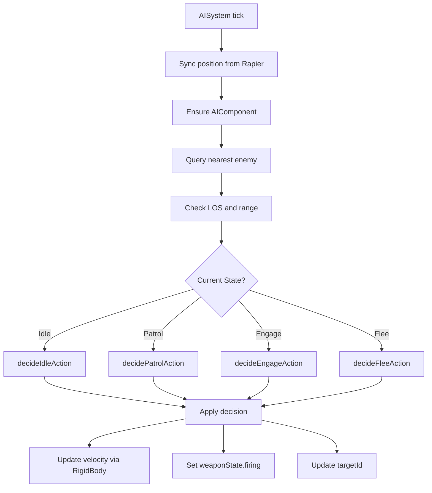

# AI System Design

**Generated:** 2025-10-03  
**Status:** Current Implementation

## Overview

The AI subsystem provides robot autonomous behavior through a lightweight state machine with four states:

- **Idle:** Standing still, occasionally switches to patrol
- **Patrol:** Wanders randomly at reduced speed
- **Engage:** Moves toward and fires at detected enemies
- **Flee:** Backs away from threats when health is critically low

AI decisions are made each fixed simulation step using pure, testable functions.

## Architecture



## Component Interface

### AIComponent

```typescript
interface AIComponent {
  state: "idle" | "patrol" | "engage" | "flee";
  stateSince: number; // timestamp in ms
}
```

Attached to robots at spawn time (currently implicit; added on first AI tick if missing).

## System Execution

### AISystem Entry Point

```typescript
function aiSystem(
  world: World<Entity>,
  rng: () => number,
  rapierWorld?: unknown,
  simNowMs?: number,
): void;
```

**Invoked:** First in the fixed-step simulation loop (before WeaponSystem).

**Responsibilities:**

1. Sync entity position from Rapier RigidBody
2. Ensure AIComponent exists
3. Query for nearest enemy
4. Check line-of-sight and range
5. Evaluate state machine transitions
6. Apply decision outputs (velocity, firing state, target)

### Decision Flow



## Module Structure

AI logic is split into testable modules:

### src/systems/AISystem.ts

Orchestrator that integrates queries, perception, and decisions.

- Iterates entities in world
- Syncs physics positions
- Calls decision functions
- Applies outputs to entity components

### src/systems/ai/queries.ts

**Exported functions:**

- `queryEnemies(world, self)` — Returns sorted array of enemy candidates by distance
- `findNearestEnemy(world, self)` — Returns nearest enemy or undefined

**Rationale:** Avoids full world scans; pre-filters by team, alive status, position.

### src/systems/ai/perception.ts

**Exported functions:**

- `canSeeTarget(self, target, range, context)` — LOS check using Rapier raycast or heuristic
- `isInRange(self, target, range)` — Distance check
- `getDistanceSquared(self, target)` — Distance utility

**Rationale:** Wraps low-level `performLineOfSight` with convenient AI-specific interface.

### src/systems/ai/decisions.ts

Pure decision functions that take context and return AIDecision objects.

**Key functions:**

- `shouldFlee(hp, maxHp)` — Health threshold check (< 25%)
- `shouldStopFleeing(hp, maxHp)` — Recovery check (> 50%)
- `decideIdleAction(context, hasTarget, hasLOS, target, stateSince, rng)`
- `decidePatrolAction(context, hasTarget, hasLOS, target, stateSince, rng)`
- `decideEngageAction(context, hasTarget, hasLOS, target, selfPos, rng)`
- `decideFleeAction(context, target, selfPos, rng)`

**AIContext:**

```typescript
interface AIContext {
  now: number;
  hp: number;
  maxHp: number;
  weaponRange: number;
  speed: number;
}
```

**AIDecision:**

```typescript
interface AIDecision {
  nextState?: AIState;
  stateSince?: number;
  targetId?: number | undefined;
  shouldFire?: boolean;
  velocity?: { x: number; y: number; z: number };
}
```

## State Behaviors

### Idle

- **Entry:** Default spawn state or when target lost
- **Actions:** Stationary, no firing
- **Transitions:**
  - → Engage if enemy detected with LOS
  - → Patrol randomly (2% chance per frame)
  - → Flee if health critical

### Patrol

- **Entry:** Random from idle, or timeout from engage
- **Actions:** Random wandering at 50% speed
- **Duration:** ~3 seconds
- **Transitions:**
  - → Engage if enemy detected with LOS
  - → Idle after timeout
  - → Flee if health critical

### Engage

- **Entry:** Enemy detected with LOS
- **Actions:**
  - Move toward target if beyond optimal range
  - Back off if too close (< 50% weapon range)
  - Fire weapon when in range and LOS
- **Transitions:**
  - → Idle if target lost
  - → Flee if health critical (< 25%)

### Flee

- **Entry:** Health below 25% threshold
- **Actions:**
  - Move away from nearest enemy
  - No firing
- **Transitions:**
  - → Engage when health recovers (> 50%) and target present
  - → Idle when health recovers and no target

## Velocity Control

AI sets velocity via `rigid.setLinvel()` when RigidBody is present:

- **Idle:** Zero velocity
- **Patrol:** Random direction, 50% speed
- **Engage:** Toward or away from target, full speed
- **Flee:** Away from threat, full speed

Position sync from physics happens before AI decisions to ensure current location is used.

## Perception Details

### Line-of-Sight

Uses `performLineOfSight()` from `src/systems/perception.ts`:

1. Attempts Rapier raycast if rapierWorld available
2. Falls back to heuristic dot-product check
3. Returns true if target visible within range

### Range Check

Simple 2D Euclidean distance (ignoring Y) compared to weapon range.

### Target Selection

Always selects nearest enemy (from `queryEnemies`). No sophisticated threat assessment yet.

## Determinism

- **RNG:** All randomness uses the seeded RNG provided by FixedStepDriver
- **Timing:** State durations and transition probabilities use `simNowMs` timestamp
- **Reproducibility:** Same seed + same initial world state = same AI behavior

## Testing Strategy

**Pure unit tests** for decision functions (no Three.js or Rapier):

- `tests/ai-decisions.test.ts` — State transitions, velocity calculations, threshold checks
- `tests/ai-queries.test.ts` — Enemy filtering and sorting
- `tests/ai-perception.test.ts` — LOS and range checks with mock entities

**Integration tests** verify AISystem orchestration in full simulation context.

### Example Test Pattern

```typescript
// Pure decision test
const context: AIContext = {
  now: 1000,
  hp: 20,
  maxHp: 100,
  weaponRange: 10,
  speed: 3,
};
const decision = decideFleeAction(context, mockTarget, selfPos, mockRng);
expect(decision.nextState).toBe("flee");
expect(decision.shouldFire).toBe(false);
```

## Known Limitations

- **Single target:** AI only engages nearest enemy; no target switching or threat prioritization
- **No formations:** Robots don't coordinate or maintain spacing
- **Simple pathfinding:** Direct line movement; no obstacle avoidance beyond physics collisions
- **Hard-coded thresholds:** Health percentages and state durations are constants
- **No cover/tactics:** AI doesn't seek advantageous positions

## Extension Points

- **Custom AI behaviors:** Add new states or decision functions
- **Behavior trees:** Replace state machine with composable behavior tree nodes
- **Learning/adaptation:** Add memory of past encounters or success rates
- **Coordinator AI:** Team-level strategies and formations
- **Difficulty tuning:** Make thresholds and reaction times configurable per difficulty level

## Files

- **Orchestrator:** `src/systems/AISystem.ts`
- **Queries:** `src/systems/ai/queries.ts`
- **Perception:** `src/systems/ai/perception.ts`, `src/systems/perception.ts`
- **Decisions:** `src/systems/ai/decisions.ts`
- **Tests:** `tests/ai-decisions.test.ts`, `tests/ai-queries.test.ts`, `tests/ai-perception.test.ts`

## Performance Notes

- **Query optimization:** `queryEnemies` pre-filters and sorts; O(n) where n = enemy count
- **Early exits:** Decision functions return immediately when conditions met
- **Position caching:** Physics position synced once per tick before decisions
- **Minimal allocations:** Decision objects reused; velocity objects created per-decision but garbage collected efficiently
