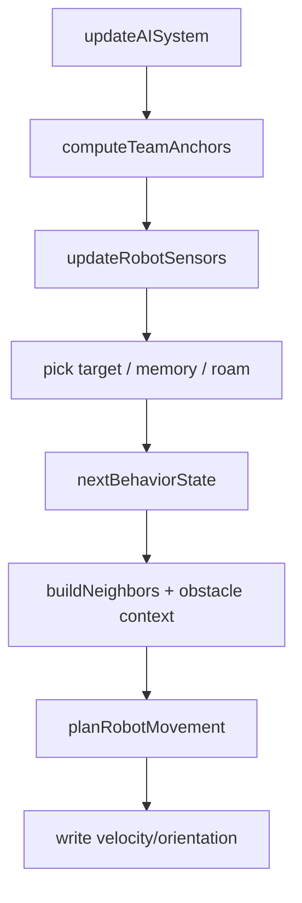

# AI System Design (as implemented)

**Updated:** 2025-12-19  
**Status:** Current Implementation

## Overview

The AI system updates each robot's targeting, behavior mode, and movement plan.
It is orchestrated by `updateAISystem` and is designed to be mostly pure logic
over the ECS data in `BattleWorld`.

Current behavior modes:

- **seek**: move toward an anchor/search/roam target and acquire enemies
- **engage**: close to effective range, strafe/pressure the enemy
- **retreat**: disengage when low-health (combat suppresses firing in this mode)

## Where it lives

- Orchestrator: `src/ecs/systems/aiSystem.ts`
- Behavior transitions: `src/simulation/ai/behaviorState.ts`
- Targeting: `src/simulation/ai/targeting.ts`
- Sensors & memory: `src/simulation/ai/sensors.ts`
- Movement planning: `src/simulation/ai/pathing/*`
- Team coordination: `src/simulation/ai/captainCoordinator.ts`
- Local neighbor data: `src/ecs/systems/aiNeighbors.ts`
- Roaming helper: `src/ecs/systems/roaming.ts`

## Data model

Robots carry an AI state object on the entity:

```ts
export interface RobotAIState {
  mode: 'seek' | 'engage' | 'retreat';
  targetId?: string;
  directive?: 'offense' | 'defense' | 'balanced';
  anchorPosition?: Vec3 | null;
  anchorDistance?: number | null;
  strafeSign?: 1 | -1;
  targetDistance?: number | null;
  visibleEnemyIds?: string[];
  enemyMemory?: Record<string, EnemyMemoryEntry>;
  searchPosition?: Vec3 | null;
  roamTarget?: Vec3 | null;
  roamUntil?: number | null;
  blockedFrames?: number;
}
```

## Update flow

`updateAISystem(world, rng)` performs, per robot:

1. Build team anchors and directives (captain coordination).
2. Update sensors (visible enemies + enemy memory).
3. Pick a target:
   - Prefer explicit `robot.ai.targetId` if still visible.
   - Captains may pick a strategic target.
   - Otherwise choose closest visible enemy.
   - If none: pursue recent memory, otherwise roam.
4. Compute `targetDistance` / `anchorDistance`.
5. Transition behavior mode using `nextBehaviorState`.
6. Plan movement (`planRobotMovement`) with:
   - behavior mode
   - current target (if any)
   - anchor/search position
   - neighbor positions (formation avoidance)
   - obstacles (for steering and wall awareness)
7. Write outputs back to the entity:
   - `robot.velocity`
   - `robot.orientation`
   - `robot.speed`

Mermaid flow:



## Key behavior notes

- AI mode affects combat: `updateCombatSystem` does not fire when `robot.ai.mode`
  is `retreat`.
- "Line of sight" and obstacle awareness are handled in the sensors/pathing
  helpers; the orchestrator passes obstacle lists and current world state.
- Enemy memory is time-bounded (see `ENGAGE_MEMORY_TIMEOUT_MS`).

## Primary files to inspect

- `src/ecs/systems/aiSystem.ts`
- `src/simulation/ai/behaviorState.ts`
- `src/simulation/ai/sensors.ts`
- `src/simulation/ai/targeting.ts`
- `src/simulation/ai/pathing/*`

