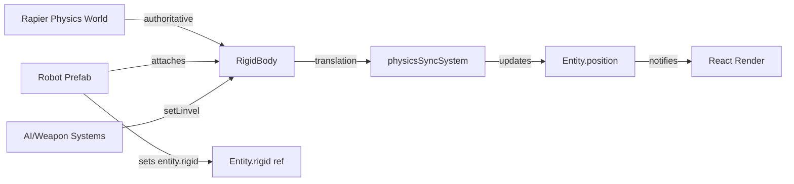
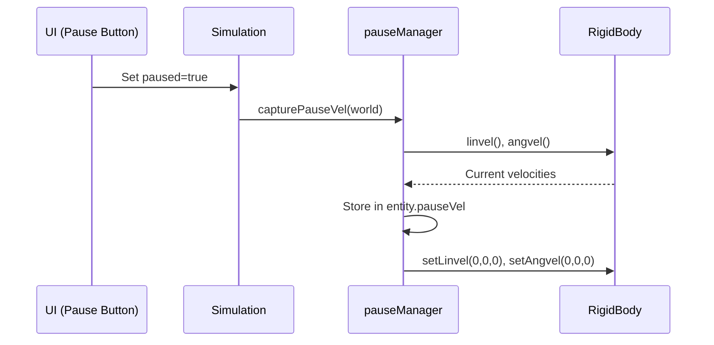
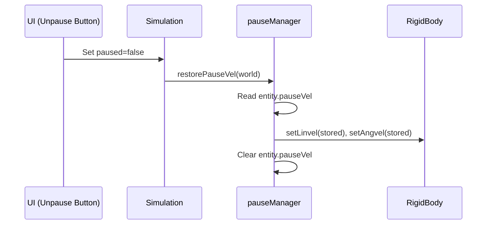

# Physics Sync Design

**Generated:** 2025-10-03  
**Status:** Current Implementation

## Overview

The physics integration establishes **Rapier RigidBody as the authoritative source of truth** for entity transforms. The ECS layer reads from physics each frame and updates component positions accordingly. This ensures consistent, physics-driven behavior while keeping the ECS as the interface for game systems.

## Architecture



## Core Principle: Physics Authority

**Rule:** When a `RigidBody` is present on an entity, **never mutate `entity.position` or mesh transforms directly**. Instead:

1. Use `rigid.setLinvel()`, `rigid.setAngvel()`, or `rigid.setTranslation()` to control motion
2. Let `physicsSyncSystem` copy authoritative physics transforms back to `entity.position`
3. React components read `entity.position` for rendering

**Why:**

- Prevents desync between physics simulation and visual state
- Ensures collision responses and velocity integrations remain consistent
- Allows physics to handle complex interactions (collisions, forces, constraints)

## Component Interfaces

### RigidBodyRef

```typescript
interface RigidBodyRef {
  rigid?: unknown | null;
}
```

Attached to entities by prefabs (e.g., `Robot`, `Projectile`) when mounting RigidBody components.

### RigidBody API (from @react-three/rapier)

```typescript
interface RigidBody {
  translation(): { x: number; y: number; z: number };
  rotation(): { x: number; y: number; z: number; w: number };
  linvel(): { x: number; y: number; z: number };
  angvel(): { x: number; y: number; z: number };
  setLinvel(v: { x: number; y: number; z: number }, wake: boolean): void;
  setAngvel(v: { x: number; y: number; z: number }, wake: boolean): void;
  setTranslation(t: { x: number; y: number; z: number }, wake: boolean): void;
  // ... more methods
}
```

## System: physicsSyncSystem

**File:** `src/systems/PhysicsSyncSystem.ts`

**Invoked:** Near end of fixed-step loop (after damage/respawn, before FX)

**Signature:**

```typescript
function physicsSyncSystem(world: World<Entity>): void;
```

**Responsibilities:**

1. Iterate all entities in world
2. Skip entities without `rigid` or `position` components
3. Read `rigid.translation()` to get authoritative physics position
4. Compare with current `entity.position` (with small epsilon threshold)
5. If changed, update `entity.position` with new vector reference
6. Notify subscribers via `notifyEntityChanged(entity)`

**Rationale:**

- Fresh vector references prevent stale object mutations
- Epsilon comparison avoids unnecessary notifications for sub-millimeter jitter
- Notifications trigger React invalidations for on-demand rendering

### Code Excerpt

```typescript
export function physicsSyncSystem(world: World<Entity>) {
  for (const entity of world.entities) {
    const e = entity as Entity & { position?: Vec3; rigid?: unknown };
    if (!e.rigid || !e.position) continue;

    const rigid = e.rigid as { translation?: () => { x; y; z } };
    if (rigid && typeof rigid.translation === "function") {
      try {
        const translation = rigid.translation();
        const newX = translation.x;
        const newY = translation.y;
        const newZ = translation.z;

        const threshold = 0.0001;
        const positionChanged =
          Math.abs(e.position[0] - newX) > threshold ||
          Math.abs(e.position[1] - newY) > threshold ||
          Math.abs(e.position[2] - newZ) > threshold;

        if (positionChanged) {
          e.position = [newX, newY, newZ];
          notifyEntityChanged(e as Entity);
        }
      } catch {
        /* defensive */
      }
    }
  }
}
```

## Pause/Resume Velocity Handling

**Problem:** When simulation pauses, physics bodies must stop moving, but should resume with original velocities when unpaused.

**Solution:** Capture and restore velocity state using `pauseVelocity` utilities.

### Pause Flow



### Resume Flow



### Pause Manager API

**File:** `src/ecs/pauseManager.ts`

**Exported functions:**

```typescript
function capturePauseVel(world: World<Entity>): void;
function restorePauseVel(world: World<Entity>): void;
```

**Storage:** Uses `entity.pauseVel` field (part of Entity type):

```typescript
pauseVel?: { lin?: Vec3; ang?: Vec3 };
```

**Implementation details:**

- Iterates all entities with `rigid` component
- Captures `linvel()` and `angvel()` via Rapier API
- Stores as Vec3 tuples in `pauseVel` field
- Zeros velocities when pausing
- Restores from storage and clears field when resuming

### Integration with Simulation

```typescript
// In Simulation.tsx
useEffect(() => {
  if (!world) return;
  if (paused) {
    capturePauseVel(world);
  } else {
    restorePauseVel(world);
  }
}, [paused]);
```

## Physics Configuration

**Provider:** `<Physics>` component in `Scene.tsx`

```typescript
<Physics
  gravity={[0, -9.81, 0]}
  paused={paused}
  updateLoop="independent"
  timeStep={1 / 60}
>
  <Simulation />
</Physics>
```

**Key settings:**

- `updateLoop="independent"` — Physics steps independently from render loop
- `timeStep={1 / 60}` — Fixed 60 FPS physics step for determinism
- `paused={paused}` — Tied to UI state; stops physics when true
- `gravity` — Standard Earth gravity (9.81 m/s²) downward

## Entity Lifecycle

### Robot Spawn

1. `spawnRobot()` creates entity with initial `position` component
2. `createRobotEntity()` adds entity to world and assigns numeric id
3. React renders `<Robot>` prefab
4. `<Robot>` mounts `<RigidBody>` at `entity.position`
5. RigidBody ref captured in `useEffect` and assigned to `entity.rigid`
6. Entity id attached to rigid and collider via `__entityId` and `userData` fields

### Per-Frame Sync

1. AI/Weapon systems call `rigid.setLinvel()` to apply forces/velocities
2. Rapier physics integrates velocities and resolves collisions
3. `physicsSyncSystem` reads `rigid.translation()` and updates `entity.position`
4. `notifyEntityChanged()` triggers React render invalidations
5. `<Robot>` prefab reads updated `entity.position` (indirectly via rigid body)

### Death/Despawn

1. DamageSystem calls `rigid.setLinvel(0,0,0)` to stop movement
2. RespawnSystem queues respawn or removes entity
3. React unmounts `<Robot>` prefab
4. `useEffect` cleanup sets `entity.rigid = null`
5. `worldController.remove()` removes entity from ECS

## Common Patterns

### Setting Velocity (AI, Projectiles)

```typescript
if (entity.rigid && typeof entity.rigid.setLinvel === "function") {
  entity.rigid.setLinvel({ x: vx, y: vy, z: vz }, true);
}
```

### Reading Position (Collision Checks)

```typescript
function getEntityPosition(entity: Entity): Vec3 | undefined {
  const rigid = entity.rigid as RigidBody | null;
  if (rigid) {
    const { x, y, z } = rigid.translation();
    return [x, y, z];
  }
  return entity.position; // fallback
}
```

### Attaching RigidBody (Prefabs)

```typescript
// In Robot.tsx
const rbRef = useRef<unknown>(null);

useEffect(() => {
  entity.rigid = rbRef.current;
  // Attach entity id to rigid for raycast mapping
  (rbRef.current as any).__entityId = entity.id;
  return () => { entity.rigid = null; };
}, []);

return (
  <RigidBody ref={rbRef} position={entity.position} colliders={false}>
    <mesh>{/* robot visual */}</mesh>
    <CuboidCollider args={[0.4, 0.6, 0.4]} />
  </RigidBody>
);
```

## Testing

**Unit tests:**

- `tests/pauseVelocity.test.ts` — Pause/resume velocity capture/restore
- `tests/pauseManager.test.ts` — Integration with world iteration
- `tests/r3f-ecs-sync.test.tsx` — Physics sync behavior
- `tests/useEntityPhysicsSync.test.tsx` — Hook-level sync logic

**Integration tests:**

- `SimulationIntegration.test.tsx` — Full physics + ECS + systems flow

**Test patterns:**

```typescript
// Mock rigid body
const mockRigid = {
  translation: vi.fn(() => ({ x: 1, y: 0.5, z: 2 })),
  linvel: vi.fn(() => ({ x: 0, y: 0, z: 0 })),
  setLinvel: vi.fn(),
};
entity.rigid = mockRigid;

// Run sync
physicsSyncSystem(world);

// Assert position updated
expect(entity.position).toEqual([1, 0.5, 2]);
expect(mockRigid.translation).toHaveBeenCalled();
```

## Known Issues & Risks

**Rapier API variance:**

- Test environments may not have full Rapier API (defensive try/catch used)
- Direct `rapier.world` access vs `useRapier()` hook can differ in method availability

**Position epsilon:**

- 0.0001 threshold may cause jitter if physics updates are extremely small
- Could be tuned or made configurable

**Pause edge cases:**

- If entity is added/removed during pause, velocity state may be lost
- Currently acceptable; respawn resets state anyway

**Projectile cleanup:**

- Projectiles without rigid bodies fall back to manual position updates
- Must ensure `physicsSyncSystem` doesn't override manual projectile movement

## Extension Points

- **Custom physics materials:** Add friction/restitution to weapon impacts
- **Force-based AI:** Replace `setLinvel()` with `applyImpulse()` for more natural movement
- **Ragdoll on death:** Keep rigid bodies active but kinematic when dead
- **Networked sync:** Serialize `translation()` and `linvel()` for multiplayer

## Files

- **Sync system:** `src/systems/PhysicsSyncSystem.ts`
- **Pause manager:** `src/ecs/pauseManager.ts`
- **Velocity storage:** `src/ecs/pauseVelocity.ts`
- **Robot prefab:** `src/robots/robotPrefab.tsx`
- **Scene config:** `src/components/Scene.tsx`
- **Tests:** `tests/pauseVelocity.test.ts`, `tests/pauseManager.test.ts`,
  `tests/r3f-ecs-sync.test.tsx`, `tests/useEntityPhysicsSync.test.tsx`
