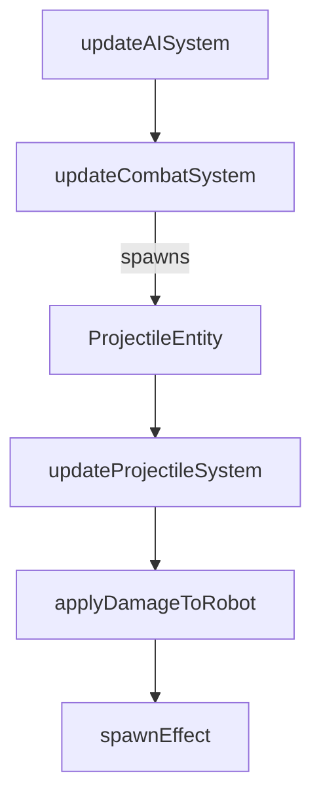

# Weapons / Combat Design (as implemented)

**Updated:** 2025-12-19  
**Status:** Current Implementation

## Overview

Combat is projectile-based for all current weapon types:

- `gun`
- `laser`
- `rocket`

Robots create projectile entities; a dedicated projectile simulation applies
hits, AoE, damage multipliers, and spawns visual effects.

## Where it lives

- Fire + cooldown gating: `src/ecs/systems/combatSystem.ts`
- Projectile simulation + damage application: `src/ecs/systems/projectileSystem.ts`
- Weapon tuning + multipliers: `src/simulation/combat/weapons.ts`
- Visuals: `src/components/vfx/*` (instancing + laser batching)

## Data model

- Robots hold:
  - `weapon`, `fireCooldown`, `fireRate`
  - `health`, `maxHealth`, `kills`
- Projectiles include:
  - `weapon`, `team`, `shooterId`, `targetId`
  - `velocity`, `speed`, `damage`, `range` (via maxDistance)
  - optional `aoeRadius` (rocket)
  - optional beam visualization fields (laser)

## Execution flow

Combat and projectile updates are driven by `BattleRunner.step()`:

## Firing rules

- A robot can fire when:
  - `robot.health > 0`
  - `robot.fireCooldown <= 0`
  - `robot.ai.mode !== 'retreat'`
  - a valid target exists and is within weapon range
- On fire:
  - a `ProjectileEntity` is created from the weapon profile
  - the robot's cooldown is reset (`1 / fireRate`)
  - telemetry records a fire event

## Damage rules

- Team filtering is hard-coded:
  - direct hits and rocket explosions skip same-team robots
  - there is no friendly-fire toggle in the current implementation
- Damage is multiplied by a weapon-vs-weapon matrix:
  - computed via `computeDamageMultiplier(attackerWeapon, targetWeapon)`
- Rocket AoE uses linear falloff: $\text{falloff} = \max(0, 1 - d/r)$.

## Telemetry + attribution

- `updateCombatSystem` records fire events.
- `updateProjectileSystem` records:
  - damage events (attackerId, targetId, teamId, amount)
  - death events (entityId, teamId, attackerId)
- Kill counts increment on the shooter entity when available.

## Visual integration

- Projectiles and effects can be instanced (quality setting).
- Laser visuals are rendered via `LaserBatchRenderer` using laser projectiles.

## Primary files to inspect

- `src/ecs/systems/combatSystem.ts`
- `src/ecs/systems/projectileSystem.ts`
- `src/simulation/combat/weapons.ts`
- `src/components/vfx/InstancedProjectiles.tsx`, `LaserBatchRenderer.tsx`,
  `InstancedEffects.tsx`
- **Profiles:** `src/robots/weaponProfiles.ts`
- **Tests:** `tests/weapon-*.test.ts`, `tests/projectile-*.test.ts`, `tests/beam-tick.test.ts`
