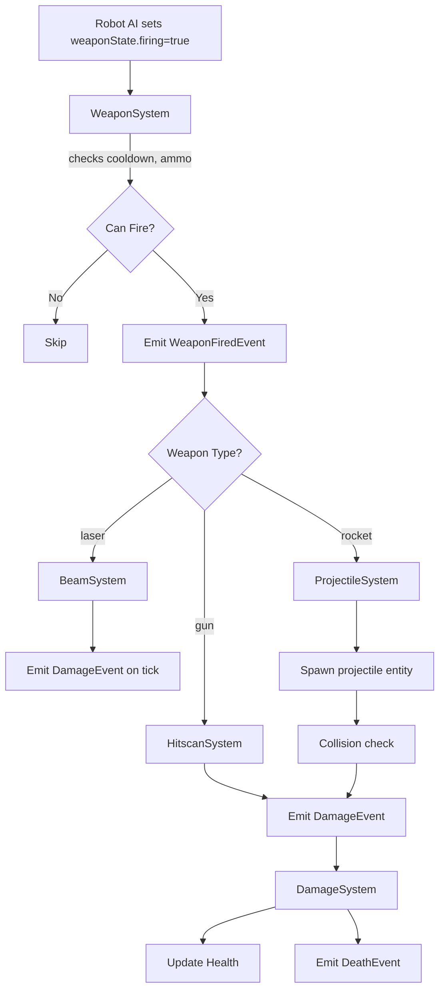
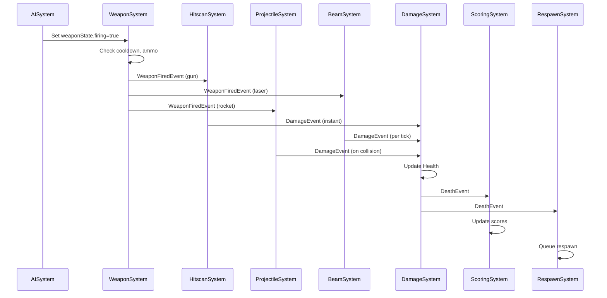

# Weapons System Design

**Generated:** 2025-10-03  
**Status:** Current Implementation

## Overview

The weapons subsystem coordinates weapon firing, hit resolution, and damage propagation across three weapon types:

- **Gun** (hitscan): instant raycast-based hits
- **Laser** (beam): continuous damage-over-time beams
- **Rocket** (projectile): physics-based projectiles with optional AoE and homing

## Architecture



## Component Interfaces

### WeaponComponent

Defines weapon capabilities and current state.

```typescript
interface WeaponComponent {
  id: string;
  type: "gun" | "laser" | "rocket";
  ownerId: number;
  team: "red" | "blue";
  range: number;
  cooldown: number; // seconds
  lastFiredAt?: number;
  power: number; // base damage
  accuracy?: number; // 0..1
  spread?: number; // radians
  ammo?: { clip: number; clipSize: number; reserve: number };
  energyCost?: number;
  projectilePrefab?: string;
  aoeRadius?: number;
  beamParams?: { duration?: number; width?: number; tickInterval?: number };
  flags?: {
    continuous?: boolean;
    chargeable?: boolean;
    burst?: boolean;
    homing?: boolean;
  };
}
```

### WeaponStateComponent

Runtime firing state managed by systems.

```typescript
interface WeaponStateComponent {
  firing?: boolean;
  reloading?: boolean;
  chargeStart?: number;
  cooldownRemaining?: number;
}
```

### WeaponFiredEvent

Event emitted by WeaponSystem when a weapon fires.

```typescript
interface WeaponFiredEvent {
  weaponId: string;
  ownerId: number;
  type: "gun" | "laser" | "rocket";
  origin: [number, number, number];
  direction: [number, number, number];
  targetId?: number;
  timestamp: number;
}
```

## Weapon Profiles

Current weapon configurations (from `src/robots/weaponProfiles.ts`):

| Weapon | Range | Cooldown | Power  | Accuracy | Special                                |
| ------ | ----- | -------- | ------ | -------- | -------------------------------------- |
| Gun    | 15m   | 0.5s     | 15     | 0.8      | Hitscan, 10-round clip, spread 0.1 rad |
| Laser  | 25m   | 1.5s     | 8/tick | 0.95     | Beam, 1s duration, 100ms tick interval |
| Rocket | 20m   | 2.0s     | 25     | 0.7      | Projectile, AoE radius 3m              |

## System Execution Flow

Systems are invoked in fixed order each simulation step (from `Simulation.tsx`):

1. **AISystem** — Sets `weaponState.firing` based on AI decisions
2. **WeaponSystem** — Manages cooldowns, ammo, emits `WeaponFiredEvent`
3. **HitscanSystem** — Processes gun-type events, performs raycasts, emits `DamageEvent` and `ImpactEvent`
4. **BeamSystem** — Processes laser-type events, spawns beam entities, ticks damage
5. **ProjectileSystem** — Processes rocket-type events, spawns projectile entities with physics
6. **DamageSystem** — Consumes `DamageEvent`, updates Health, emits `DeathEvent`
7. **ScoringSystem** & **RespawnSystem** — Process death events

## Weapon Resolution Details

### Hitscan (Gun)

- **Resolution:** Instant raycast from origin in direction
- **Rapier integration:** Attempts `rapier.castRay()` or `queryPipeline.castRay()` when available
- **Fallback:** Heuristic dot-product-based targeting when Rapier unavailable
- **Spread:** Applied as yaw adjustment based on `weapon.spread * (1 - accuracy)`
- **Output:** `DamageEvent` with hit position, `ImpactEvent` for visual FX
- **Tests:** `hitscan-determinism.test.ts`, `weapon-targeting.test.ts`

### Beam (Laser)

- **Resolution:** Creates beam entity with lifespan and tick-based damage
- **Lifecycle:** Beam lives for `beamParams.duration` ms, applies damage every `tickInterval` ms
- **Raycast:** Performs per-tick Rapier raycast to determine current hit point
- **Output:** `DamageEvent` emitted on each tick hit
- **Continuous:** Beam entities persist until `activeUntil` timestamp expires
- **Tests:** `beam-tick.test.ts`

### Projectile (Rocket)

- **Resolution:** Spawns physics-enabled projectile entity
- **Physics:** Optional Rapier RigidBody for collision; fallback to ECS position updates
- **Collision:** Custom collision checks against robot entities within radius
- **AoE:** On impact, applies falloff damage to all entities within `aoeRadius`
- **Homing:** Optional homing behavior adjusts velocity toward target each step
- **Friendly-fire:** Respects `useUI().friendlyFire` toggle
- **Lifespan:** Projectiles despawn after 5 seconds or on impact
- **Output:** `DamageEvent` for direct hit or AoE damage
- **Tests:** `projectile-aoe.test.ts`, `projectile-friendly-fire.test.ts`,
  `weapon-projectile-behavior.test.ts`, `projectile-streak.test.ts`

## Friendly-Fire Handling

- **UI Toggle:** `useUI().friendlyFire` (default: false)
- **Gun/Laser:** HitscanSystem and BeamSystem skip same-team targets
- **Rocket:** ProjectileSystem collision checks ignore same-team entities when friendly-fire is disabled
- **AoE edge case:** Projectile impacts still register (for VFX) but no damage applied to friendlies
- **Tests:** `projectile-friendly-fire.test.ts`, `weapon-edgecases.test.ts`

## Event Flows



## SourceId Propagation

Critical for friendly-fire and scoring:

1. **WeaponSystem** emits `WeaponFiredEvent` with `ownerId` (robot entity id)
2. **Hitscan/Beam** systems pass `ownerId` directly to `DamageEvent.sourceId`
3. **ProjectileSystem** creates projectile entity with `projectile.ownerId` field
4. On collision, projectile passes `projectile.ownerId` to `DamageEvent.sourceId`
5. **DamageSystem** uses `sourceId` to look up killer team for scoring

**Known risk:** If weapon ownership changes mid-flight (e.g., respawn),
sourceId may reference a stale entity. Current mitigation: projectiles
store ownerId at spawn time.

## Testing Strategy

- **Unit tests:** Test individual system logic with mock events and world states
- **Deterministic tests:** Use `FixedStepDriver` with seeded RNG for reproducible weapon behavior
- **Edge cases:** Friendly-fire, AoE overlaps, rapid-fire cooldowns, ammo depletion
- **Integration tests:** Full weapon → damage → death flow in `SimulationIntegration.test.tsx`

## Extension Points

- **New weapon types:** Add to `WeaponType` union, implement resolver in new system
- **Weapon upgrades:** Modify `WeaponComponent` fields at runtime
- **Ammo/energy systems:** Expand `ammo` and `energyCost` fields, add resource systems
- **Visual FX:** Systems emit `ImpactEvent` consumed by `FxSystem` and rendered by `FXLayer`

## Files

- **Coordinator:** `src/systems/WeaponSystem.ts`
- **Resolvers:** `src/systems/HitscanSystem.ts`, `src/systems/BeamSystem.ts`,
  `src/systems/ProjectileSystem.ts`
- **Definitions:** `src/ecs/weapons.ts`
- **Profiles:** `src/robots/weaponProfiles.ts`
- **Tests:** `tests/weapon-*.test.ts`, `tests/projectile-*.test.ts`, `tests/beam-tick.test.ts`
